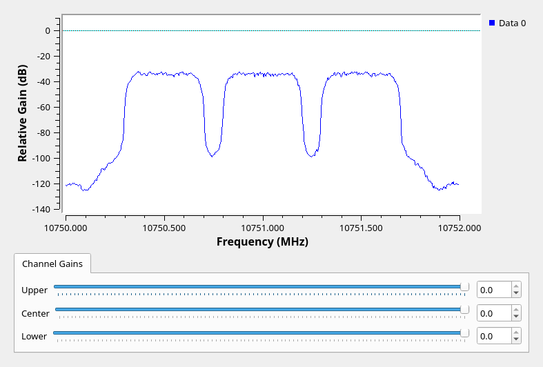

# DVB-S2 Receiver Testbed

This repository contains a GNU Radio flowgraph that generates three closely
spaced DVB-S2 test signals, the strengths of which can be adjusted on the fly.

The aim is to approximate adjacent-signal conditions typically seen on the
QO-100 wideband transponder, to help evaluate the suitability of receiver
equipment for that scenario, and to test software modifications in a
reproducible way. **This setup is intended for direct connection to a receiver
in bench testing, not for use on the air.**

The flowgraph has been tested with both HackRF One and PlutoSDR devices.
Preconfigured sink blocks for both are included. The output is set to a level
which should be suitable to feed directly to a receiver in place of an LNB
output. **A DC block MUST be used, to prevent the 12/18V DC bias of the
receiver from damaging the SDR!**

Out of the box, the flowgraph is set up to produce three signals centred at
1001 MHz with 500kHz spacing, each with 333kS/s symbol rate, QPSK modulation,
and 1/2 FEC, with 0.20 rolloff and pilots off. All these settings can be
modified in the flowgraph as desired. Each signal has a separate service name
identifying it, and plays a different short MPEG-TS video loop.

## Setup

You will need the following prerequisites:

### Hardware

- Any transmitter supported by GNU Radio with a suitable bandwidth and
  frequency range. Tested at 2MHz sample rate with:
    - [HackRF One](https://greatscottgadgets.com/hackrf/one/)
    - [ADALM-PLUTO](https://www.analog.com/en/design-center/evaluation-hardware-and-software/evaluation-boards-kits/adalm-pluto.html)
- **A DC block to protect the transmitter from the 12/18V bias voltage present
  at the receiver!**

### Software

- [GNU Radio](https://www.gnuradio.org/) (tested with 3.10.5)
- [FFmpeg](https://ffmpeg.org) (tested with 5.1.4)
- [gr-pipe](https://github.com/jolivain/gr-pipe) (tested with commit `c9c067b`)
- [GNU Make](https://www.gnu.org/software/make/)

### Video files

Download the following free video files from [pixabay](https://pixabay.com) in
1280x720 MP4 format:
  - [Particles](https://pixabay.com/videos/particles-abstract-glow-light-28136/):
    save as `particles.mp4`
  - [Waves](https://pixabay.com/videos/waves-sea-ocean-storm-water-tide-71122/):
    save as `waves.mp4`
  - [Tunnel](https://pixabay.com/videos/tunnel-yellow-abstract-background-12904/):
    save as `tunnel.mp4`

These files were chosen because they are short, they loop seamlessly, they are
easily distinguishable at a glance, and they contain plenty of motion but
remain recognisable when encoded at low bit rates.

### Preparation
- Run `make` to generate the MPEG-TS streams using `ffmpeg`.

If you modify the transmission settings in the flowgraph, you will need to
update the stream rate and video bitrate by editing the `MUXRATE` and `VIDRATE`
values in the `Makefile`, then run `make` to regenerate the streams.

The appropriate `MUXRATE` value for the modulation and coding parameters
selected can be found using the `dvbs2rate` program from
[dtv-utils](https://github.com/drmpeg/dtv-utils). You can follow the
instructions
[here](https://kb.ettus.com/Transmitting_DVB-S2_with_GNU_Radio_and_an_USRP_B210#Encoding_a_Transport_Stream_from_MP4_Video)
to build and use this tool.

When generating streams, check the output for the message `dts < pcr, TS is
invalid`. This indicates that the video did not fit within the stream rate. If
this happens, reduce `VIDRATE` until the message goes away.

## Running

1. Open the `dvbs2_rx_test.grc` flowgraph in GNU Radio Companion. By default, no hardware sink is enabled. Check there are no errors (red blocks or settings).
2. Press the play button. The following window should appear. If not, check the log window for reported errors.

3. To enable hardware output, enable either the Osmocom sink (for HackRF) or the PlutoSDR sink, and then bypass the Throttle block.
4. Tune receiver to the desired frequency. To help with this, frequencies are shown including the common LNB offset of 9750 MHz. If your receiver is configured with a different LNB offset, you can set this in the `lnb_freq` variable. This only affects the display. The actual output frequency is set by `tx_freq`, by default 1001 MHz.

## Author

Martin Ling M0LNG, November 2023
